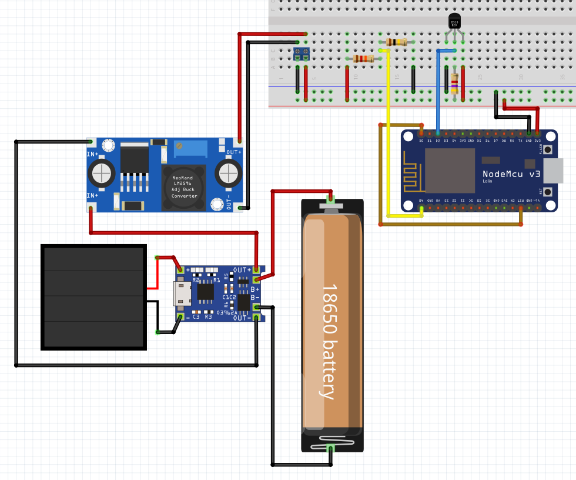
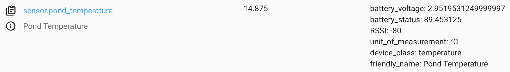
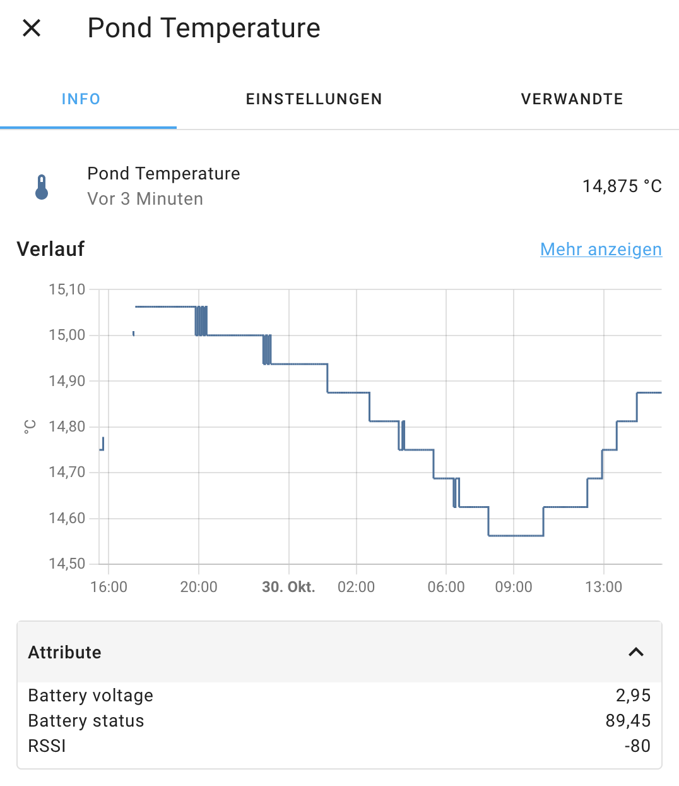
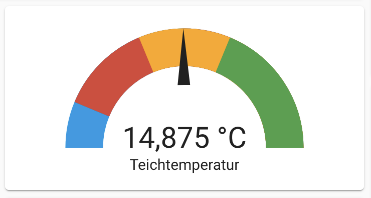
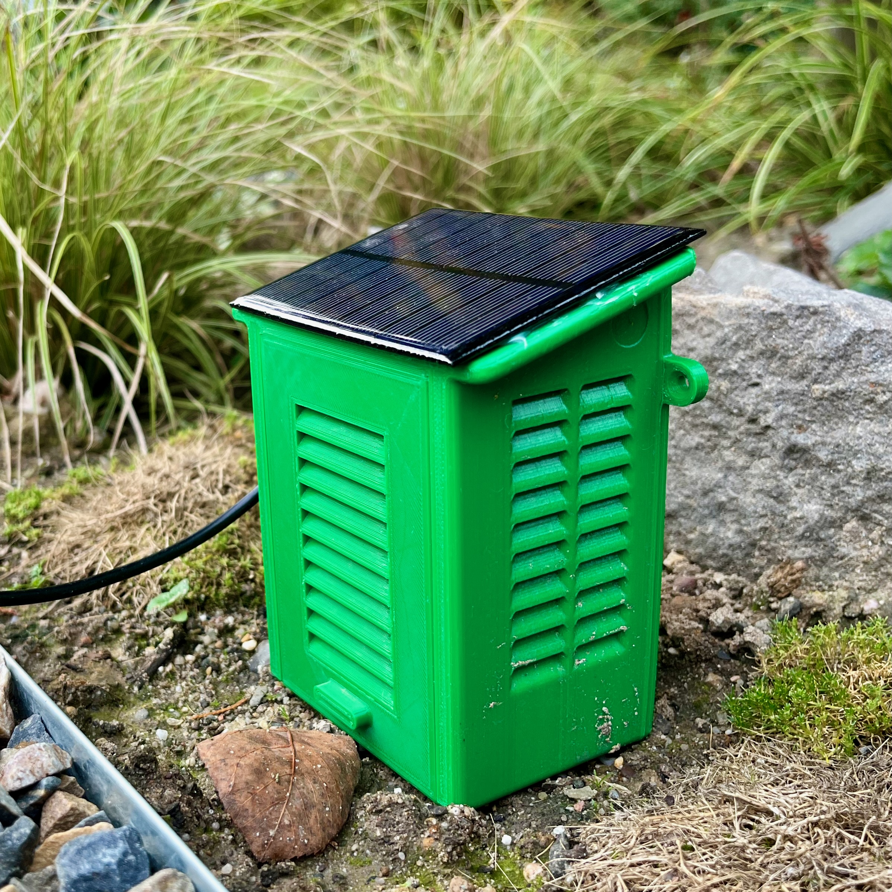

# ESP-Temperature Sensor for Ponds or Pools using Home Assistant and MQTT Integration
A sketch for an ESP 8266 based micro controller and an DS18B20 temperature sensor to measure the temperature of a pond or pool using Home Assistant and MQTT.

## TL;DR

## The Software
### Sketch

### MQTT (Discovery)

#### Topics and Messages

##### Configuration (for MQTT Discovery)
"homeassistant/sensor/sensorPondT/config"
```` json
{
 "device_class":"temperature",
 "name":"Pond Temperature",
 "object_id":"pond_temperature",
 "state_topic":"homeassistant/sensor/sensorPondT/state",
 "availability_topic":"homeassistant/sensor/sensorPondT/status",
 "json_attributes_topic":"homeassistant/sensor/sensorPondT/attributes",
 "unit_of_measurement":"°C",
 "value_template":"{{ value_json.temperature}}"
}
````
##### State - Temperature
"homeassistant/sensor/sensorPondT/state"

##### Attributes
"homeassistant/sensor/sensorPondT/attributes"

##### Status
"homeassistant/sensor/sensorPondT/status"

## The Hardware

## The Wiring


### Configure the Buck Converter

## The Configuration

## The Home Assistant Integration 
### Sensor




### View (Example)



## The Case
