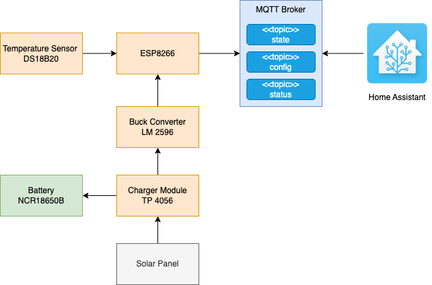
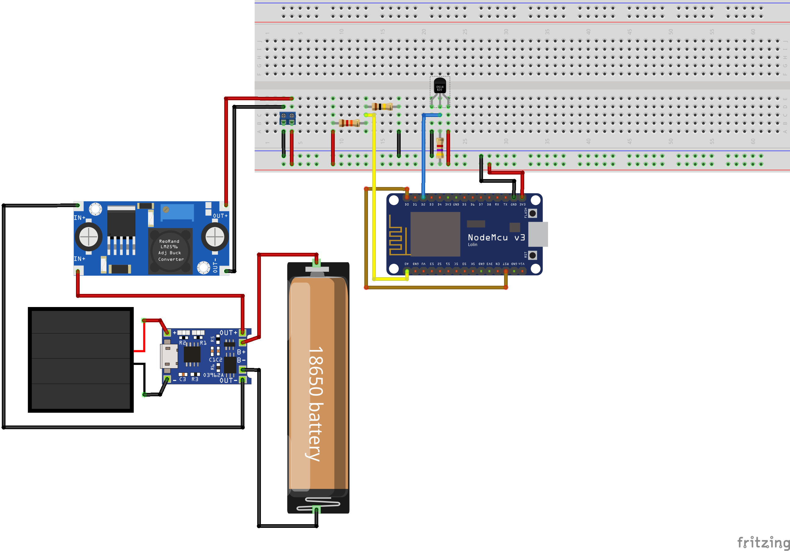
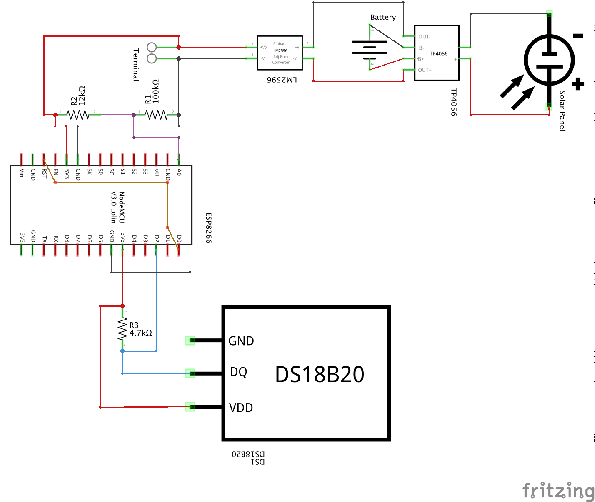

# ESP-Temperature Sensor for Ponds or Pools using Home Assistant and MQTT Integration

## TL;DR
A sketch for an ESP 8266 based micro controller and an DS18B20 temperature sensor to measure the temperature of a pond or pool using Home Assistant and MQTT.



## The Software
### Sketch

### MQTT

I use the [Mosquitto](https://mosquitto.org/) Broker which fits my requirements perfectly. You can also find an official [Docker Image](https://hub.docker.com/_/eclipse-mosquitto) of it.
I recommend a GUI based client like MQTT Explorer or MQTT.fx for testing purposes.

#### Topics and Messages

Once the sensor is running, you'll find three new topics on your broker:

##### Configuration (for MQTT Discovery)
(see also: [MQTT Discovery](https://www.home-assistant.io/docs/mqtt/discovery/))
homeassistant/sensor/sensorPondT/config
```` json
{
 "device_class":"temperature",
 "name":"Pond Temperature",
 "object_id":"pond_temperature",
 "state_topic":"homeassistant/sensor/sensorPondT/state",
 "availability_topic":"homeassistant/sensor/sensorPondT/status",
 "json_attributes_topic":"homeassistant/sensor/sensorPondT/attributes",
 "unit_of_measurement":"°C",
 "value_template":"{{ value_json.temperature}}"
}
````
##### State - Temperature
homeassistant/sensor/sensorPondT/state
````json
{"temperature":14.9375}
````
##### Attributes
This topic imcludes additional attributes which will be added to the configured sensor.
"homeassistant/sensor/sensorPondT/attributes"
````json
{
 "battery_voltage":2.9455078125,
 "battery_status":89.2578125,
 "RSSI":-81
}
````
##### Status
This indicates if the sensor is availble or not.

homeassistant/sensor/sensorPondT/status
````
online | offline 
````
## The Hardware

## The Wiring


### Configure the Buck Converter

## The Configuration

## The Home Assistant Integration 
### Sensor


### View (Example)


```` yaml
- type: gauge
  entity: sensor.pond_temperature
  name: Pond Temperature
  unit: "°C"
  needle: true
  min: -5
  max: 35
  severity:
    red: 0
    yellow: 10
    green: 20
````


## The Case
